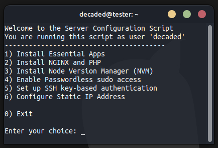

# Handy Ubuntu System Setup Script

[](https://github.com/Decaded/install-script)
[](https://github.com/Decaded/install-script/issues)
[](https://github.com/Decaded/install-script/pulls)
[](https://github.com/Decaded/install-script/commits)

Welcome to this nifty Ubuntu System Setup Script! This script is your go-to tool for setting up and supercharging your Ubuntu system in a jiffy. It's all about making your system
cooler, more secure, and tuned to your liking.

## Cool Stuff You Can Do

### Get Must-Have Tools

1. **[htop](https://htop.dev/)** - Check out what's going on with your system processes in a flash.
2. **[screen](https://www.gnu.org/software/screen/)** - Split your terminal like a pro.
3. **[nload](https://github.com/rolandriegel/nload)** - Keep an eye on your network traffic.
4. **[nano](https://www.nano-editor.org/)** - A simple and friendly text editor.
5. **[firewalld](https://firewalld.org/)** - Manage your firewall settings with ease:
   - Automatically opens your SSH port (with options for customization).
6. **[fail2ban](https://github.com/fail2ban/fail2ban)** - Ward off intruders with this handy tool:
   - Configure it with default settings or go custom.
7. **[git](https://git-scm.com/)** - The go-to tool for version control:
   - We'll help you set it up if it's your first time.
8. **[unattended-upgrades](https://help.ubuntu.com/community/AutomaticSecurityUpdates)** - Stay safe with automatic security updates.

### SSH Authentication

- Switch to key-based authentication for enhanced security (as requested in [issue #1](https://github.com/Decaded/install-script/issues/1)).
- You can later revert to password authentication using the option in the menu: `Restore SSH Configuration`.
- The script automatically creates a backup of your SSH configuration (`sshd_config`) before making changes. It's stored at `/etc/ssh/sshd_config_decoscript.backup`.
  - **Warning**: Running the script again will overwrite the existing backup file. To preserve it, consider renaming or copying it to another location.

### Passwordless Sudo Access

- Elevate your powers without the hassle of password prompts.
- Don't worry; we won't mess with it if you're already in the passwordless sudo club.

### Web Server Delight

- Want to host a website? We've got you covered with [Nginx](https://www.nginx.com/) & [PHP 8.1 (php-fpm)](https://www.php.net/releases/8_1_0.php).
- We'll even open up ports 80 and 443 TCP/UDP in the firewall (if you have `firewalld` installed).
- And if you're still hanging out with [Apache2](https://httpd.apache.org/), we'll give it a polite send-off.

### Node.js Goodness

- Ready to explore the world of Node.js? We've got you covered with [Node Version Manager (NVM)](https://github.com/nvm-sh/nvm).
- With NVM, you can:
  - Seamlessly switch between different Node.js versions.
  - Easily manage Node.js installations.
  - Keep your Node.js environment up-to-date with the latest releases.

### Configure Static IP Address (New!)

- Set a static IP address for your system with ease.
- Specify the IP address, subnet mask, gateway, and DNS servers.
- Enjoy a stable network configuration.
- As requested in [issue #4](https://github.com/Decaded/install-script/issues/4).

---

## How to Make Magic Happen

1. **Download** this _awesome_ script

   ```bash
   wget https://raw.githubusercontent.com/Decaded/install-script/main/install.sh
   ```

2. **Give it Permission to Run**:

   ```bash
   sudo chmod +x install.sh
   ```

3. **Run the Script**:

   ```bash
   ./install.sh
   ```

And then, just pick the goodies you want from our cool menu:

<div align="center">
  
</div>

---

## Join the Fun

We're all ears! If you spot something funky or have ideas for making this script even cooler, share it with us via [issues](https://github.com/Decaded/install-script/issues).

## License

This project is licensed under the [MIT License](LICENSE).

---

## Quick Word of Caution

> This script comes as is, without any guarantees. It's your adventure, so be mindful. The author isn't a super-tech guru, so use it with a touch of caution.
