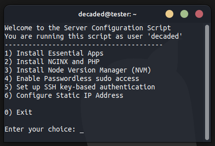

# Hello There, internet traveler

## Overview

This is a menu-driven server utility script for Ubuntu and other Debian-based systems. It helps automate common setup tasks without forcing one fixed stack. You choose what to install or configure:
essential tools, Nginx, PHP, MySQL, NVM, SSH hardening, Fail2ban, static IP profiles, and more.

Ubuntu is the primary target environment. Other Debian derivatives should work, but some minimal images, SBC images, and custom kernels may need extra care. If you encounter an issue,
open an [issue](https://github.com/Decaded/install-script/issues) and include your OS, kernel version, and the menu option that failed.

<div align="center">
  <a href="https://github.com/Decaded/install-script">
    
  </a>
  <a href="https://github.com/Decaded/install-script/issues">
    
  </a>
  <a href="https://github.com/Decaded/install-script/pulls">
    
  </a>
  <a href="https://github.com/Decaded/install-script/commits">
    
  </a>
</div>

---

## Installation and Usage

1. Download the script:

   ```bash
   wget https://raw.githubusercontent.com/Decaded/install-script/main/install.sh
   ```

2. Make it executable:

   ```bash
   sudo chmod +x install.sh
   ```

3. Run it:

   ```bash
   ./install.sh
   ```

The script requires sudo privileges and checks for them on startup. A menu will appear with the available actions.

<div align="center">
  
</div>

---

## Features

### Main Menu

- Install selected essential apps
- Install a web server stack
- Install Node Version Manager (NVM)
- Enable passwordless sudo
- Configure SSH key-only authentication
- Configure a static IP address
- Configure Fail2ban
- Revert static IP configuration to DHCP
- Check for script updates
- Restore SSH configuration when a backup exists

### Essential Tools

Install any combination of common utilities from a checklist:

- **[htop](https://htop.dev/)** and **[btop](https://github.com/aristocratos/btop)** - process viewers
- **[screen](https://www.gnu.org/software/screen/)** and **[tmux](https://github.com/tmux/tmux/wiki)** - terminal multiplexers
- **[nload](https://github.com/rolandriegel/nload)** - network traffic monitor
- **[nano](https://www.nano-editor.org/)** and **[Neovim](https://neovim.io/)** - text editors
- **[firewalld](https://firewalld.org/)** - firewall management
- **[fail2ban](https://github.com/fail2ban/fail2ban)** - intrusion prevention
- **[git](https://git-scm.com/)** - version control
- **[unattended-upgrades](https://wiki.debian.org/UnattendedUpgrades)** - automatic security updates
- **[Pi-hole](https://pi-hole.net/)** - ad blocker and optional DHCP server

When selected, some tools offer follow-up configuration. Firewalld asks for the current SSH port, opens that port, and checks for working netfilter/nftables support before trying to start
the service. Fail2ban can use the default setup or a custom `jail.local` URL. Git can configure global name, email, and default branch.

### SSH Configuration

Switch to key-only SSH authentication. The script:

- Disables password-based logins
- Enables public key authentication
- Adds the provided public key to `~/.ssh/authorized_keys`
- Creates a backup of your SSH config
- Provides a restore option when a backup exists

Backup file location:

```bash
/etc/ssh/sshd_config_decoscript.backup.*
```

The script keeps the five most recent SSH config backups.

### Passwordless Sudo

Enables password-free sudo access if desired. If your system already uses this configuration, the script leaves it unchanged.

### Web Server Setup

Choose one of three web server paths:

- Full **LEMP** stack: **[Nginx](https://nginx.org/)**, **[MySQL](https://www.mysql.com/)**, and **[PHP](https://www.php.net/)**
- **Nginx + PHP**
- **Nginx only**

The web server setup can:

- Remove Apache2 if it is installed, to avoid port conflicts
- Enable and start Nginx
- Install common PHP/FPM packages and configure Nginx for PHP
- Create `/etc/nginx/cert` for SSL certificates
- Create a simple default page if the web root is empty
- Open HTTP and HTTPS ports when firewalld is available

### Node.js via NVM

Installs the latest **[NVM](https://github.com/nvm-sh/nvm)** version and lets you choose a Node.js version to install:

- Lists recent remote Node.js versions
- Installs the version you enter

### Static IP Configuration

Configure a static IP address using **Netplan**.

Supports:

- IP address
- Subnet
- Gateway
- DNS servers

If Netplan is not present, the script installs `netplan.io` before writing the configuration. It also installs `net-tools` when needed to list network interfaces.

Before changing an existing Netplan file, the script creates a backup under:

```bash
/etc/netplan/backups_decoscript/
```

A revert option is available from the main menu to switch an interface back to DHCP.

---

## Notes

- Firewalld depends on working kernel netfilter/nftables support. On some minimal Armbian or SBC images, firewalld may not be usable until the kernel is updated and the system is rebooted.
- SSH and network changes can disconnect you from a remote server if incorrect values are entered. Keep another access path available when possible.

---

## Contributing and Issues

If you notice unexpected behavior or have a suggestion, [open an issue](https://github.com/Decaded/install-script/issues).

Pull requests are welcome.

---

## License

This project is available under the [MIT License](LICENSE).

---

## Disclaimer

This script performs operations that modify system configuration. Use it responsibly, review options before applying them, and keep backups of important files.

> This script comes as is, without any guarantees. It's your adventure, so be mindful.
